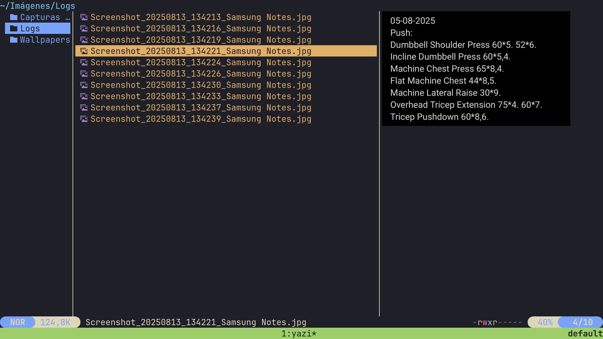
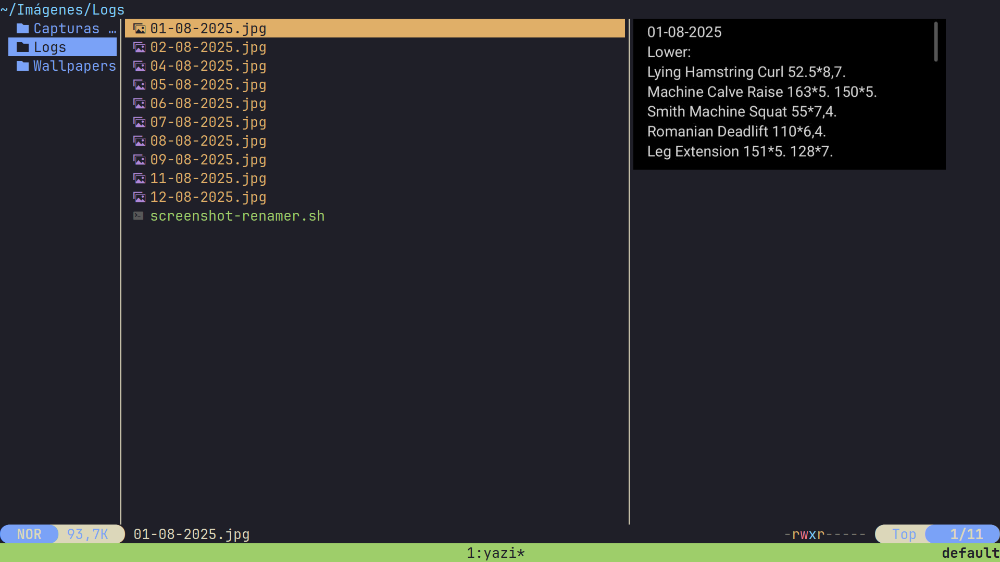

## Scripts

Idioma/Language/Idioma:
- Español: Este README está en portugués. Si prefieres otro idioma, cambia a la rama `en` (English) o vuelve a `main` (Español).
- English: This README is in Portuguese. If you prefer another language, switch to branch `en` (English) or go back to `main` (Spanish).
- Português: Este README está em português. Se preferir outro idioma, mude para a branch `en` (English) ou `main` (Espanhol).

Um repositório onde investi horas automatizando tarefas para não fazer 10 minutos de trabalho manual.

Este repositório contém scripts utilitários. Por enquanto, inclui um único script:

- **`screenshot-renamer.sh`**: renomeia imagens `.jpg`/`.jpeg` detectando a data diretamente do conteúdo da imagem via OCR, e gera nomes no formato `DD-MM-YYYY[_N].ext` (onde `[_N]` é adicionado automaticamente para evitar colisões). Fiz isso para não precisar renomear manualmente cada screenshot dos meus registros de academia, onde acompanho o progresso treino a treino.

### `screenshot-renamer.sh`

- **O que faz**:
  - Procura uma data na imagem usando Tesseract OCR (ES/EN) e diferentes padrões de data (ISO `YYYY-MM-DD`, `DD-MM-YYYY`, `DD de Mes de YYYY`, `Month DD, YYYY`, etc.).
  - Se encontrar uma data, renomeia o arquivo como `DD-MM-YYYY.ext`. Se esse nome já existir, cria `DD-MM-YYYY_1.ext`, `DD-MM-YYYY_2.ext`, etc.
  - Somente processa arquivos com extensão `.jpg` ou `.jpeg`.

- **Requisitos**:
  - `tesseract` (obrigatório)
  - `convert` do ImageMagick (opcional, melhora o pré-processamento da imagem para um OCR mais confiável)

- **Uso**:
  - Ajuda rápida: `./screenshot-renamer.sh --help`
  - Processar todas as imagens `.jpg/.jpeg` do diretório atual:
    ```bash
    ./screenshot-renamer.sh
    ```
  - Processar arquivos específicos:
    ```bash
    ./screenshot-renamer.sh foto1.jpg outra_pasta/foto2.jpeg
    ```

- **Instalação/permissão de execução**:
  ```bash
  chmod +x screenshot-renamer.sh
  ```

- **Notas**:
  - Se nenhuma data for detectada na imagem, o arquivo permanece inalterado.
  - O pré-processamento (tons de cinza, contraste, nitidez e limiar) é aplicado quando `convert` está disponível para melhorar o OCR.

### Demonstração

- Antes de executar o script:
  
  

- Depois de executar o script (renomeado pela data detectada):

  

